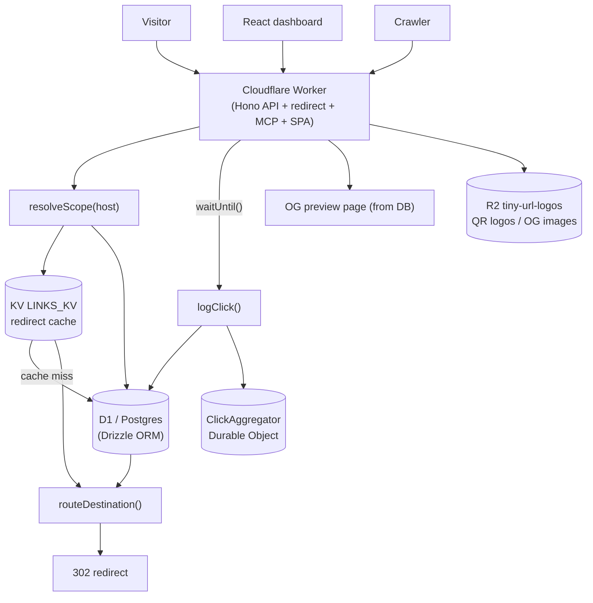

# Tiny URL — self-hosted URL shortener on Cloudflare

> **Open-source, self-hosted URL shortener and link-management platform** — a Bitly / TinyURL alternative you fully own. Branded short links on your own domain, a QR-code studio, bot-filtered click analytics, a REST API and an MCP server — running entirely on **Cloudflare Workers** for **$0** on the free plan.

Create short links on **your own domain** (`go.yoursite.com/<slug>`), track every click with privacy-first analytics, and manage every link from one dashboard — **no monthly SaaS bill, no vendor lock-in**.

[](https://deploy.workers.cloudflare.com/?url=https://github.com/rithwik-01/tiny-url)

> **Deploy your own in one click** with the button above — or clone and `npm run dev` for local.
> Stack: **Cloudflare Workers · Hono · React 19 + Vite + Tailwind v4 · Drizzle ORM · Postgres or D1**

---

## Features

- **Branded short links** — random or custom back-halves, per-domain slugs, expiry, pause, tags and search, per-OS deep links, per-country routing, password-protected links, UTM builder, bulk CSV import.
- **Privacy-first analytics** — totals, uniques, time charts, countries, referrers, device/browser/OS, live feed; bot traffic auto-excluded; CSV/JSON export.
- **QR-code studio** — frames, shapes, colors, gradients, logo library, saved presets; export PNG / SVG / JPEG.
- **REST API + MCP server** — API keys and 12 MCP tools so AI agents can manage links.
- **Self-hosted human check** — invisible proof-of-work plus optional mini-game CAPTCHA, no third party.
- **AI link assistant** (optional) — one-click slug and social-card suggestions via Workers AI, with an offline fallback.
- **$0 on Cloudflare** — Workers + KV + R2 + (D1 or Postgres), free-tier friendly; everything is configured in-app, no redeploys.

## Architecture

One Cloudflare Worker serves the JSON API, the redirect hot path, the MCP server, and the SPA. Reads are cached at the edge in KV; writes go to Drizzle ORM on D1 (default) or Postgres; QR logos and OG images live in R2; two SQLite-backed Durable Objects handle rate limiting and click rollups; custom domains ride Cloudflare for SaaS with a DNS-TXT fallback.



The redirect hot path resolves the scope, hits KV (falling back to the database on a miss), applies geo / deep-link / safety rules, and returns a `302` with `Cache-Control: private,no-store`; click logging happens asynchronously via `waitUntil`. See [docs/ARCHITECTURE.md](docs/ARCHITECTURE.md) for the full pipeline and data model.

---

## Quick start (local, ~5 minutes)

You need **Node 22+** and a Postgres database (or use **D1** — no external DB; see below).

```bash
# 1. Install
npm install
cp .dev.vars.example .dev.vars

# 2. Fill in .dev.vars — generate secrets with:  openssl rand -hex 32
#    SESSION_SECRET   = a long random string (>= 32 bytes — the app refuses to start otherwise)
#    SETUP_TOKEN      = any random token (gates the first-run installer)
#    ...HYPERDRIVE_LOCAL_CONNECTION_STRING... = your Postgres URL

# 3. Create the database schema
npm run db:migrate

# 4. Run it (Vite + Worker together, hot-reload)
npm run dev
```

Open the app — you will land on the **`/setup`** installer. Enter your `SETUP_TOKEN`, create the admin account, and you are in. That is the whole local setup.

> **Prefer zero external services?** Use **Cloudflare D1** instead of Postgres — see [docs/DEPLOYMENT.md → Database](docs/DEPLOYMENT.md#step-3--pick-your-database). Local dev simulates D1, KV, and R2 automatically, so `npm run dev` just works.

## Going to production

With **D1** there is nothing to provision (KV + R2 + D1 auto-create on first deploy). `wrangler secret put` your two secrets, set an **`APP_URL`** env var to your domain (one value — the route is derived from it, no file edits; see [docs/CUSTOM-DOMAINS.md](docs/CUSTOM-DOMAINS.md)), then `npm run deploy` (it also applies the D1 schema). Full copy-paste walkthrough in [docs/DEPLOYMENT.md](docs/DEPLOYMENT.md).

## Configuration

Three layers, from least to most flexible: deploy-time bindings in `wrangler.jsonc` (worker name, `APP_URL` default, `DB_DRIVER`, D1/KV/R2/AI/Durable Object bindings), secrets via `wrangler secret` or `.dev.vars` (`SESSION_SECRET`, `SETUP_TOKEN`, connection strings), and admin knobs in the app (branding, SEO, abuse limits, custom domains, AI assistant, click-logging mode, retention). Full reference in [docs/CONFIGURATION.md](docs/CONFIGURATION.md).

## API

- **REST** — `GET /api/config`, `GET /api/health`, `GET /api/qr/:slug`, and `POST /api/unlock/:slug` are public; everything else lives under `/api` (`/auth`, `/captcha`, `/links`, `/admin`, `/setup`, `/qr-presets`, `/assets`, `/domains`, `/projects`, `/keys`, `/account`) with session or `sk_` API-key auth, plus versioned aliases (`/api/v1/links`, `/api/v1/domains`, `/api/v1/projects`).
- **Redirect** — `GET /:slug` serves crawler OG previews, password unlock pages, geo/deep-link routing, and safety interstitials before the `302`.
- **MCP** — `POST /mcp` is a stateless Streamable-HTTP JSON-RPC server with 12 tools: `get_overview`, `create_link`, `list_links`, `get_link`, `update_link`, `delete_link`, `get_link_stats`, `get_link_activity`, `list_domains`, `list_projects`, `bulk_import`, `get_qr`.

## Development

| Script | Description |
| --- | --- |
| `npm run dev` | Local dev server (client + Worker, hot-reload) |
| `npm run build` | Build client → `dist/client`, Worker → `dist/tiny_url` |
| `npm run deploy` | Build + deploy to Cloudflare (also auto-applies D1 migrations) |
| `npm run typecheck` | Type-check client, Worker, and Node configs |
| `npm run db:migrate` | Apply Postgres migrations (reads `.dev.vars`) |
| `npm run db:migrate:d1` | Apply D1 migrations `--remote` (resolves the auto-provisioned id) |
| `npm run db:generate` / `:sqlite` | Generate a Drizzle migration after a schema change (do **both**) |
| `npm run db:studio` | Open Drizzle Studio |
| `npm run test:*` | Focused `tsx` suites (`routing`, `password`, `blocklist`, `captcha`, `captcha:flow`, `captcha:risk`, `ai`, `e2e`) |

See [docs/CONFIGURATION.md](docs/CONFIGURATION.md#dev-helper-scripts) for the dev seed helpers.

```
worker/            Hono backend — JSON API, redirect hot path, MCP server, click logging
  db/              Drizzle schemas (Postgres + D1 mirror) and the per-request client
  lib/             auth, password (peppered PBKDF2), slug rules, domain scoping, edge cache,
                   settings, rate limiting, human check, account lifecycle, social/SEO, retention
  middleware/      per-request DB, session + API-key auth, CSRF/origin, security headers
  routes/          auth, links, stats, projects, domains, qr-presets, assets, keys, account, admin
  mcp.ts           MCP server (stateless Streamable HTTP JSON-RPC)
src/               React SPA (pages, shadcn-style UI)
shared/            DTOs + brand-page renderers shared by Worker + client
drizzle/           Generated SQL migrations (drizzle/sqlite mirrors them for D1)
docs/              The guides linked above
```

## Documentation

| Doc | What's inside |
| --- | --- |
| **[docs/DEPLOYMENT.md](docs/DEPLOYMENT.md)** | Step-by-step deploy to production — copy-paste friendly |
| **[docs/CUSTOM-DOMAINS.md](docs/CUSTOM-DOMAINS.md)** | Put the app on your own domain + give members theirs (Workers Custom Domains / Cloudflare for SaaS) |
| **[docs/CLOUDFLARE-API-TOKEN.md](docs/CLOUDFLARE-API-TOKEN.md)** | Create the API tokens this project uses, with least-privilege permissions |
| **[docs/CONFIGURATION.md](docs/CONFIGURATION.md)** | Every setting: deploy-time (wrangler), secrets, and the admin knobs |
| **[docs/ARCHITECTURE.md](docs/ARCHITECTURE.md)** | How it works: request pipeline, redirect hot path, data model, the $0 design |
| **[docs/TROUBLESHOOTING.md](docs/TROUBLESHOOTING.md)** | Common errors and how to fix them |
| **[docs/human-check-v3.md](docs/human-check-v3.md)** | The human-check (CAPTCHA) threat model |

## License

MIT — see [LICENSE](LICENSE). Copyright (c) 2026 Rithwik Reddy Eedula.
